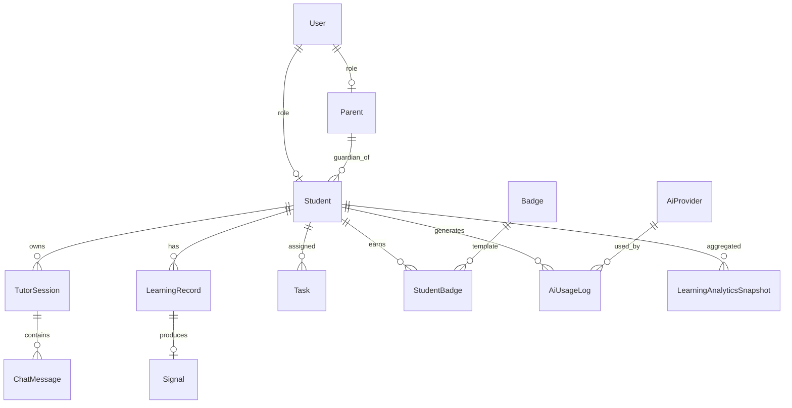

# StudySignal 資料模型規劃

> **最後更新：** 2026-06-29  
> **相關文件：** [`ARCHITECTURE.md`](./ARCHITECTURE.md)、[`API.md`](./API.md)、[`ROADMAP.md`](./ROADMAP.md)  
> **文件性質：** 資料庫／持久化層規劃（非現有 ORM schema）

---

## 狀態圖例

| 標記 | 意義 |
|------|------|
| ✅ **已完成** | 已有持久化儲存（資料庫或等同機制） |
| 🟡 **規劃** | 架構已定義，尚未建表或僅有前端暫存對應 |
| ⚪ **尚未實作** | 無對應儲存與程式碼 |

---

## 現況總覽

StudySignal **Beta 階段尚未引入資料庫**（無 Prisma、Drizzle、Supabase 等）。學習資料主要存在：

| 機制 | 內容 | 狀態 |
|------|------|------|
| React `useState` | 聊天氣泡（`chatItems`）、Signals 歷史（最多 5 筆） | 🟡 執行期暫存 |
| `blob:` URL | 語音錄音預覽 | 🟡 記憶體／瀏覽器，重整即失 |
| `localStorage` | 僅 Mic 診斷面板位置／收合 | ✅ 本機 UI 偏好 |
| 伺服器 | 無 session／無 user 表 | ⚪ |

**目標（V1.5 起）：** 引入關聯式或文件型資料庫，將下方規劃表逐步實作；客戶端型別（如 `ChatListItem`、`AnalyzeFeedback`）作為 API／DB 契約參考。

### 規劃 ER 關係（目標架構）



---

# 使用者（User）

| 項目 | 說明 |
|------|------|
| **狀態** | ⚪ 尚未實作 |
| **用途** | 系統登入身分根實體；區分家長、學生（及未來教師／管理員） |

### 主要欄位（規劃）

| 欄位 | 類型 | 說明 |
|------|------|------|
| `id` | UUID | 主鍵 |
| `email` | string | 登入用（可選，視驗證策略） |
| `phone` | string | 可選 |
| `display_name` | string | 顯示名稱 |
| `role` | enum | `parent` \| `student` \| `admin`（可擴充） |
| `password_hash` | string | 或改為 OAuth `provider_subject` |
| `locale` | string | 預設 `zh-TW` |
| `created_at` | timestamp | 建立時間 |
| `updated_at` | timestamp | 更新時間 |
| `deleted_at` | timestamp | 軟刪除（可選） |

### 與其他資料表關係

- **1 : 0..1** `Parent`（`role = parent` 時）
- **1 : 0..1** `Student`（`role = student` 時）
- **1 : N** `AiUsageLog`（若依使用者記帳）

### 現況對應

- 無帳號系統；所有使用者視為匿名單機 session。

---

# 家長（Parent）

| 項目 | 說明 |
|------|------|
| **狀態** | ⚪ 尚未實作 |
| **用途** | 家長模式：檢視子女學習摘要、每日報告、Signals 趨勢（唯讀） |

### 主要欄位（規劃）

| 欄位 | 類型 | 說明 |
|------|------|------|
| `id` | UUID | 主鍵 |
| `user_id` | UUID | FK → `User.id` |
| `notification_email` | string | 每日報告寄送（可選） |
| `notification_enabled` | boolean | 是否接收報告 |
| `created_at` | timestamp | |
| `updated_at` | timestamp | |

### 與其他資料表關係

- **N : 1** `User`
- **1 : N** `ParentStudentLink`（或 `Student.parent_id`）→ 綁定多位學生
- **唯讀關聯** `LearningRecord`、`Signal`、`LearningAnalyticsSnapshot`（透過學生 ID 查詢）

### 現況對應

- ROADMAP V1.5「家長模式」為規劃項目，無 UI 帳號與無資料表。

---

# 學生（Student）

| 項目 | 說明 |
|------|------|
| **狀態** | 🟡 規劃（前端僅有學制 UI 設定，無持久化） |
| **用途** | 學習主體；擁有對話、分析、任務、徽章與學習歷程 |

### 主要欄位（規劃）

| 欄位 | 類型 | 說明 |
|------|------|------|
| `id` | UUID | 主鍵 |
| `user_id` | UUID | FK → `User.id` |
| `nickname` | string | 暱稱 |
| `school_level` | enum | `elementary` \| `junior` \| `senior`（對應現有 `SchoolLevel`） |
| `grade` | string | 年級（可選） |
| `preferred_speech_lang` | enum | `en-US` \| `en-GB` |
| `subjects` | jsonb | 科目偏好（對應 Tools「我的」設定） |
| `created_at` | timestamp | |
| `updated_at` | timestamp | |

### 與其他資料表關係

- **N : 1** `User`
- **N : M** `Parent`（透過關聯表）
- **1 : N** `TutorSession`、`ChatMessage`（經 session）
- **1 : N** `LearningRecord`、`Signal`、`Task`、`StudentBadge`、`AiUsageLog`、`LearningAnalyticsSnapshot`

### 現況對應

- `StudySignalHome` 內 `SchoolLevel`、科目為 **React state**，重整後重置。
- 狀態：**🟡 規劃**（產品概念與 UI 已有，資料庫未實作）。

---

# 對話（Chat）

| 項目 | 說明 |
|------|------|
| **狀態** | 🟡 規劃（前端暫存 ✅ 邏輯層；資料庫 ⚪） |
| **用途** | 儲存 Tutor 與學生之間的單則訊息；支援文字、分析結果引用、語音錄音 metadata |

### 主要欄位（規劃：`chat_messages`）

| 欄位 | 類型 | 說明 |
|------|------|------|
| `id` | UUID | 主鍵 |
| `tutor_session_id` | UUID | FK → `TutorSession.id` |
| `sequence` | int | 同 session 內排序 |
| `role` | enum | `student` \| `tutor` |
| `body` | text | 訊息正文 |
| `speech_text` | text | TTS 用替代文字（可選，對應 `speechText`） |
| `voice_recording_url` | string | 物件儲存 URL（非 `blob:`） |
| `voice_recording_mime` | string | 可選 |
| `analyze_feedback_id` | UUID | FK → `Signal.id`（可選，學生訊息綁分析） |
| `created_at` | timestamp | |

### 與其他資料表關係

- **N : 1** `TutorSession`
- **0..1 : 1** `Signal`（學生訊息觸發分析時）

### 現況對應（前端型別，非 DB）

```typescript
// src/types/chatListItem.ts — ChatListItem
// id, role: "tutor" | "student", body, speechText?, analysis?, voiceRecordingObjectUrl?
```

- 存在 `chatItems` state；清除對話即丟棄。
- **持久化：** ⚪ 尚未實作。

---

# Tutor Session

| 項目 | 說明 |
|------|------|
| **狀態** | ⚪ 尚未實作 |
| **用途** | 一次連續 Tutor 對話的容器（開啟 App → 清除對話 之間，或未來「存檔對話」單位） |

### 主要欄位（規劃：`tutor_sessions`）

| 欄位 | 類型 | 說明 |
|------|------|------|
| `id` | UUID | 主鍵 |
| `student_id` | UUID | FK → `Student.id` |
| `title` | string | 自動摘要或使用者命名（可選） |
| `status` | enum | `active` \| `archived` |
| `message_count` | int | 快取計數 |
| `last_message_at` | timestamp | |
| `created_at` | timestamp | |
| `ended_at` | timestamp | 可選 |

### 與其他資料表關係

- **N : 1** `Student`
- **1 : N** `ChatMessage`
- **1 : N** `AiUsageLog`（可選，依 session 彙總 token）

### 現況對應

- 單一頁面內一組 `chatItems` 即隱式 session，無 `session_id`。
- API `/api/tutor-chat` 無狀態，歷史由客戶端每次 POST 帶入 messages。

---

# Voice Test

| 項目 | 說明 |
|------|------|
| **狀態** | ⚪ 尚未實作（開發頁面無需持久化） |
| **用途** | 可選：記錄 TTS 除錯 session，供支援與裝置相容性分析 |

### 主要欄位（規劃：`voice_test_logs`，可選）

| 欄位 | 類型 | 說明 |
|------|------|------|
| `id` | UUID | 主鍵 |
| `student_id` | UUID | FK（可 null，匿名除錯） |
| `user_agent` | text | 瀏覽器 UA |
| `selected_voice_us` | string | en-US 選中語音名 |
| `selected_voice_uk` | string | en-GB 選中語音名 |
| `test_text` | text | 試聽文字 |
| `lang` | enum | `en-US` \| `en-GB` |
| `created_at` | timestamp | |

### 與其他資料表關係

- **N : 0..1** `Student`（正式產品可省略此表，僅開發遙測）

### 現況對應

- `/voice-test` 純客戶端 `speechSynthesis`，**不寫入任何儲存**。
- 建議：**正式產品可不建表**；若需遙測標為 🟡 規劃、⚪ 未實作。

---

# Speech Test

| 項目 | 說明 |
|------|------|
| **狀態** | ⚪ 尚未實作 |
| **用途** | 可選：記錄語音辨識／分析實驗結果（開發與 QA） |

### 主要欄位（規劃：`speech_test_logs`，可選）

| 欄位 | 類型 | 說明 |
|------|------|------|
| `id` | UUID | 主鍵 |
| `student_id` | UUID | FK（可 null） |
| `recognition_transcript` | text | SpeechRecognition 結果 |
| `analyze_feedback_id` | UUID | FK → `Signal.id`（若呼叫 `/api/analyze`） |
| `error_code` | string | 辨識錯誤 |
| `user_agent` | text | |
| `created_at` | timestamp | |

### 與其他資料表關係

- **N : 0..1** `Student`
- **0..1 : 1** `Signal`

### 現況對應

- `/speech-test` 為開發實驗頁，無持久化。
- 與 Voice Test 相同：**產品可省略**；狀態 ⚪ 尚未實作。

---

# 學習紀錄（Learning Record）

| 項目 | 說明 |
|------|------|
| **狀態** | ⚪ 尚未實作 |
| **用途** | 跨 session 的學習事件時間軸：對話、翻譯、分析、任務完成等 |

### 主要欄位（規劃：`learning_records`）

| 欄位 | 類型 | 說明 |
|------|------|------|
| `id` | UUID | 主鍵 |
| `student_id` | UUID | FK → `Student.id` |
| `event_type` | enum | `chat` \| `translate` \| `analyze` \| `task_complete` \| `voice_practice` 等 |
| `source_id` | UUID | 多型關聯：指向 session／message／signal／task |
| `source_type` | string | `tutor_session` \| `chat_message` \| `signal` \| `task` |
| `summary_zh` | text | 繁中摘要（供家長／歷程列表） |
| `payload` | jsonb | 輕量 metadata（不含大圖 base64） |
| `occurred_at` | timestamp | 事件時間 |
| `created_at` | timestamp | 寫入時間 |

### 與其他資料表關係

- **N : 1** `Student`
- **多型關聯** `TutorSession`、`ChatMessage`、`Signal`、`Task`
- **1 : N** 供 `LearningAnalyticsSnapshot` 聚合

### 現況對應

- 無時間軸；Signals 僅記憶體內最近 5 筆分析（`analyzeFeedbackHistory`）。
- ROADMAP V1.5「學習歷程」→ ⚪ 尚未實作。

---

# Learning Analytics

| 項目 | 說明 |
|------|------|
| **狀態** | ⚪ 尚未實作 |
| **用途** | 預先聚合的統計快照：使用頻率、弱項分佈、分數趨勢、能力維度變化 |

### 主要欄位（規劃：`learning_analytics_snapshots`）

| 欄位 | 類型 | 說明 |
|------|------|------|
| `id` | UUID | 主鍵 |
| `student_id` | UUID | FK → `Student.id` |
| `period_type` | enum | `daily` \| `weekly` \| `monthly` |
| `period_start` | date | 區間起 |
| `period_end` | date | 區間迄 |
| `chat_turn_count` | int | 對話輪數 |
| `analyze_count` | int | 分析次數 |
| `avg_grammar_score` | decimal | 可 null |
| `avg_vocabulary_score` | decimal | |
| `avg_fluency_score` | decimal | |
| `avg_pronunciation_score` | decimal | 僅語音分析樣本 |
| `weak_tags` | jsonb | 弱項標籤陣列 |
| `computed_at` | timestamp | 批次計算時間 |

### 與其他資料表關係

- **N : 1** `Student`
- **資料來源** `LearningRecord`、`Signal`（離線或排程 job 聚合）

### 現況對應

- ROADMAP V2.0；無後端聚合管線。
- **能力地圖** UI 依賴此層資料 → ⚪ 尚未實作。

---

# Signals

| 項目 | 說明 |
|------|------|
| **狀態** | 🟡 規劃（API 與前端結構 ✅；資料庫 ⚪） |
| **用途** | 儲存 `/api/analyze` 結構化回饋，供 Signals 分頁、家長報告、Analytics 使用 |

### 主要欄位（規劃：`signals`）

| 欄位 | 類型 | 說明 |
|------|------|------|
| `id` | UUID | 主鍵 |
| `student_id` | UUID | FK → `Student.id` |
| `chat_message_id` | UUID | FK（可 null） |
| `input_text` | text | 分析輸入摘要 |
| `include_pronunciation` | boolean | 是否語音發音分支 |
| `has_images` | boolean | 是否含圖 |
| `grammar_score` | int | 0–100 |
| `vocabulary_score` | int | |
| `fluency_score` | int | |
| `pronunciation_overall` | int | 可 null |
| `feedback_json` | jsonb | 完整 `AnalyzeFeedback`（含 `pronunciationFocus`、`tutorComment` 等） |
| `image_insights_json` | jsonb | `imageInsights`（可 null） |
| `analyzed_at` | timestamp | |

### 與其他資料表關係

- **N : 1** `Student`
- **0..1 : 1** `ChatMessage`
- **1 : N** `LearningRecord`（事件引用）
- **聚合至** `LearningAnalyticsSnapshot`

### 現況對應

**前端暫存（非 DB）：**

```typescript
type SignalAnalyzeHistoryEntry = {
  id: string;
  analyzedAt: number;
  feedback: AnalyzeFeedback;
};
// 最多 MAX_SIGNAL_ANALYZE_HISTORY = 5 筆
```

**型別契約：** `src/lib/analyzeFeedback.ts` → `AnalyzeFeedback` ✅ 已完成。

**持久化：** ⚪ 尚未實作。

---

# 任務（Task）

| 項目 | 說明 |
|------|------|
| **狀態** | ⚪ 尚未實作 |
| **用途** | AI 或系統派發的每日／每週學習任務（對話、練習字詞、分析等） |

### 主要欄位（規劃）

**`task_templates`（任務定義）**

| 欄位 | 類型 | 說明 |
|------|------|------|
| `id` | UUID | 主鍵 |
| `code` | string | 穩定識別碼 |
| `title_zh` | string | 標題 |
| `description_zh` | text | 說明 |
| `task_type` | enum | `chat_turns` \| `pronunciation` \| `analyze` \| `custom` |
| `criteria_json` | jsonb | 完成條件 |
| `reward_badge_id` | UUID | FK → `Badge.id`（可選） |

**`student_tasks`（學生任務實例）**

| 欄位 | 類型 | 說明 |
|------|------|------|
| `id` | UUID | 主鍵 |
| `student_id` | UUID | FK → `Student.id` |
| `template_id` | UUID | FK → `task_templates.id` |
| `status` | enum | `pending` \| `in_progress` \| `completed` \| `expired` |
| `due_at` | timestamp | 截止 |
| `completed_at` | timestamp | 可 null |
| `progress_json` | jsonb | 進度 |
| `created_at` | timestamp | |

### 與其他資料表關係

- **N : 1** `Student`
- **N : 1** `TaskTemplate`
- **完成時** 寫入 `LearningRecord`、可能觸發 `StudentBadge`

### 現況對應

- ROADMAP V1.5；無任務 UI 與無 API。

---

# 徽章（Badge）

| 項目 | 說明 |
|------|------|
| **狀態** | ⚪ 尚未實作 |
| **用途** | 成就與任務獎勵的視覺化標章定義與發放紀錄 |

### 主要欄位（規劃）

**`badges`（定義）**

| 欄位 | 類型 | 說明 |
|------|------|------|
| `id` | UUID | 主鍵 |
| `code` | string | 唯一代碼，如 `streak_7_days` |
| `name_zh` | string | 顯示名稱 |
| `description_zh` | text | 說明 |
| `icon_url` | string | 圖示 |
| `tier` | enum | `bronze` \| `silver` \| `gold` 等 |
| `created_at` | timestamp | |

**`student_badges`（發放紀錄）**

| 欄位 | 類型 | 說明 |
|------|------|------|
| `id` | UUID | 主鍵 |
| `student_id` | UUID | FK → `Student.id` |
| `badge_id` | UUID | FK → `badges.id` |
| `earned_at` | timestamp | |
| `source_type` | string | `task` \| `analytics` \| `manual` |
| `source_id` | UUID | 可選 |

### 與其他資料表關係

- **N : M** `Student` ↔ `Badge`（透過 `student_badges`）
- **N : 1** `TaskTemplate`（任務獎勵）

### 現況對應

- ROADMAP V1.5 成就系統；無相關程式。

---

# AI 使用紀錄（AI Usage Log）

| 項目 | 說明 |
|------|------|
| **狀態** | ⚪ 尚未實作 |
| **用途** | 追蹤每次 AI 呼叫：端點、模型、token 估算、成本、延遲、成功與否（控管與帳務） |

### 主要欄位（規劃：`ai_usage_logs`）

| 欄位 | 類型 | 說明 |
|------|------|------|
| `id` | UUID | 主鍵 |
| `student_id` | UUID | FK（可 null，匿名 Beta） |
| `tutor_session_id` | UUID | FK（可選） |
| `ai_provider_id` | UUID | FK → `AiProvider.id` |
| `endpoint` | enum | `tutor_chat` \| `analyze` \| `transcribe` \| `tts` |
| `model` | string | 如 `gpt-4o-mini`、`whisper-1` |
| `prompt_tokens` | int | 可 null |
| `completion_tokens` | int | 可 null |
| `latency_ms` | int | |
| `status` | enum | `success` \| `error` |
| `error_message` | text | 可 null |
| `estimated_cost_usd` | decimal | 可選 |
| `created_at` | timestamp | |

### 與其他資料表關係

- **N : 1** `Student`、`AiProvider`
- **N : 0..1** `TutorSession`
- **不存** 完整 prompt／圖片 base64（隱私與容量）；僅 metadata

### 現況對應

- API Route 僅 `console.log`（如 analyze debug）；無結構化紀錄表。
- 符合「低成本優先」現階段不強制；V2.0 多 Provider 時建議實作。

---

# AI Provider

| 項目 | 說明 |
|------|------|
| **狀態** | 🟡 規劃（執行期僅 `OPENAI_API_KEY` 環境變數 ✅；設定表 ⚪） |
| **用途** | 登錄可用 AI 廠商與模型設定，支援 Provider Registry 切換 |

### 主要欄位（規劃：`ai_providers`）

| 欄位 | 類型 | 說明 |
|------|------|------|
| `id` | UUID | 主鍵 |
| `code` | string | `openai` \| `gemini` \| `claude` \| `grok` \| `local` |
| `display_name` | string | 顯示名稱 |
| `is_active` | boolean | 是否啟用 |
| `is_default` | boolean | 預設 Provider |
| `config_json` | jsonb | 非密鑰設定（base URL、預設模型） |
| `created_at` | timestamp | |
| `updated_at` | timestamp | |

### 主要欄位（規劃：`ai_provider_models`）

| 欄位 | 類型 | 說明 |
|------|------|------|
| `id` | UUID | 主鍵 |
| `provider_id` | UUID | FK → `ai_providers.id` |
| `capability` | enum | `chat` \| `vision` \| `transcribe` \| `tts` |
| `model_id` | string | 廠商模型 ID |
| `is_default` | boolean | 該 capability 預設 |

### 與其他資料表關係

- **1 : N** `AiProviderModel`
- **1 : N** `AiUsageLog`

### 現況對應

| 項目 | 狀態 |
|------|------|
| `OPENAI_API_KEY` 環境變數 | ✅ 執行期設定 |
| Route 硬編碼 OpenAI URL／模型 | ✅ 已完成 |
| Provider Registry／Adapter | ⚪ 尚未實作 |
| `ai_providers` 資料表 | ⚪ 尚未實作 |

**設計備註：** API Key **不存入** `config_json`；應使用密鑰管理（環境變數、Vault）。資料表僅記錄「哪個 Provider 啟用、用哪個 model_id」。

---

## 輔助關聯表（規劃）

### `parent_student_links`

| 欄位 | 說明 |
|------|------|
| `parent_id` | FK → `Parent.id` |
| `student_id` | FK → `Student.id` |
| `relationship` | `guardian` \| `other` |
| `created_at` | |

**狀態：** ⚪ 尚未實作

---

## 實作階段建議

| 階段 | 資料表優先順序 |
|------|----------------|
| **V1.0** | 可仍無 DB；或僅 `Student`（本機 profile）+ `signals` 匯出 |
| **V1.5** | `User`、`Parent`、`Student`、`tutor_sessions`、`chat_messages`、`signals`、`learning_records`、`task_*`、`badges`、`student_badges` |
| **V2.0** | `learning_analytics_snapshots`、`ai_providers`、`ai_provider_models`、`ai_usage_logs` |
| **可選** | `voice_test_logs`、`speech_test_logs`（僅遙測需要時） |

### 技術選型（規劃，未決定）

- 關聯式：PostgreSQL + Prisma／Drizzle
- 或 BaaS：Supabase（Auth + Postgres）
- 大物件：圖片／音訊存 **物件儲存**（S3 相容），DB 只存 URL
- `feedback_json`：JSONB 欄位對齊現有 `AnalyzeFeedback` 型別，減少 migration 成本

---

## 狀態總表

| 實體 | 資料庫 | 前端／API 暫存 | 整體 |
|------|--------|----------------|------|
| User | ⚪ | — | ⚪ 尚未實作 |
| Parent | ⚪ | — | ⚪ 尚未實作 |
| Student | ⚪ | 🟡 UI 設定 | 🟡 規劃 |
| Chat（ChatMessage） | ⚪ | 🟡 `ChatListItem` | 🟡 規劃 |
| Tutor Session | ⚪ | 🟡 隱式 session | 🟡 規劃 |
| Voice Test | ⚪ | ✅ 客戶端頁面 | ⚪ 日誌未實作 |
| Speech Test | ⚪ | ✅ 客戶端頁面 | ⚪ 日誌未實作 |
| 學習紀錄 | ⚪ | — | ⚪ 尚未實作 |
| Learning Analytics | ⚪ | — | ⚪ 尚未實作 |
| Signals | ⚪ | 🟡 最多 5 筆 | 🟡 規劃 |
| Task | ⚪ | — | ⚪ 尚未實作 |
| Badge | ⚪ | — | ⚪ 尚未實作 |
| AI 使用紀錄 | ⚪ | — | ⚪ 尚未實作 |
| AI Provider | ⚪ | 🟡 環境變數 | 🟡 規劃 |

---

**請勿因閱讀本文件而修改任何 `.ts`、`.tsx`、`package.json` 或 Next.js 設定。**

**本任務僅建立／更新 `docs/DATABASE.md`。**

---

*StudySignal — 讓學習訊號清晰可見。*
