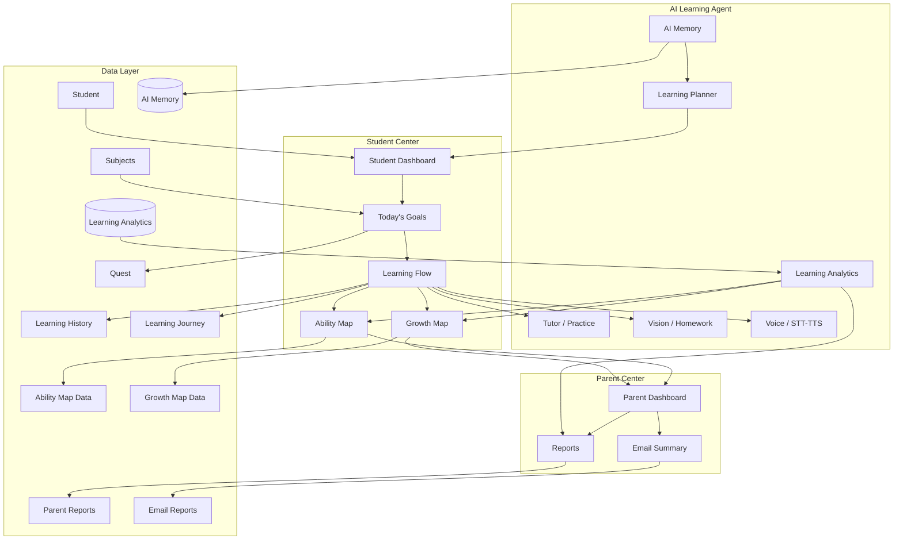
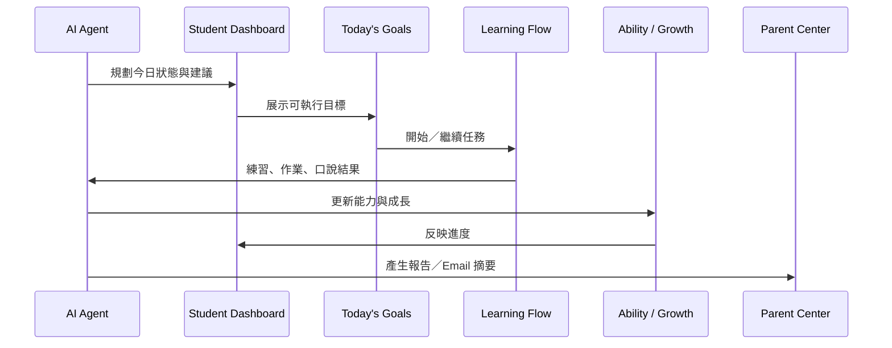
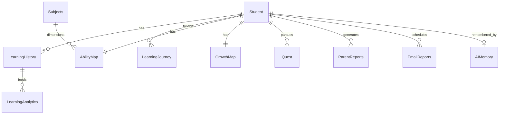
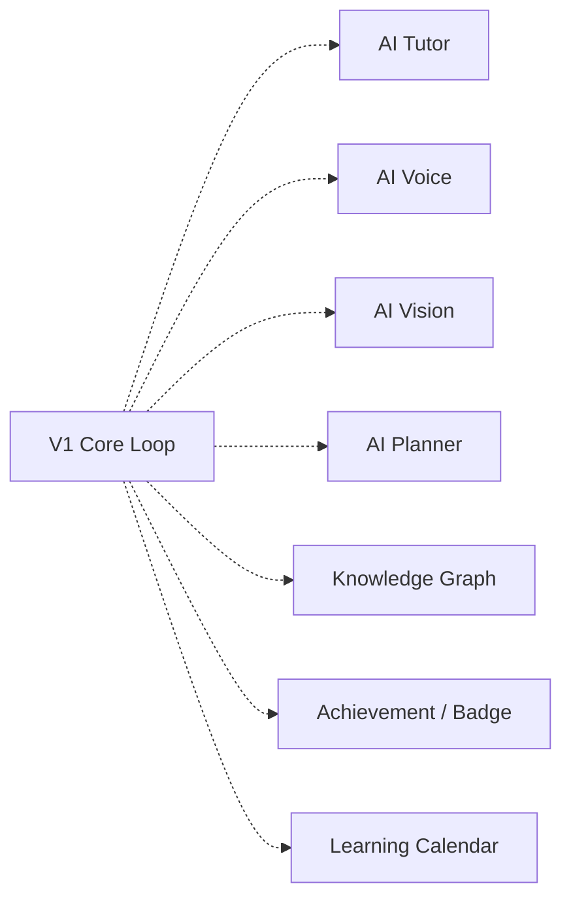

# StudySignal Product Architecture

> 產品架構文件：說明 StudySignal 是什麼、系統如何分層、資料與 AI 職責如何分工。  
> UI 細節見 [`UI_DESIGN_V1.md`](./UI_DESIGN_V1.md)。技術／API／資料庫細節可另見 `ARCHITECTURE.md`、`API.md`、`DATABASE.md`。

**版本：** V1  
**狀態：** Draft — 產品與架構對齊用  
**對象：** 產品、工程、設計

---

## Core Concept

StudySignal 是 **AI Learning Agent**。

它**不是**聊天機器人。

| 聊天機器人 | StudySignal AI Learning Agent |
|------------|-------------------------------|
| 等使用者發問 | **主動規劃**每日學習 |
| 對話即產品 | 對話只是學習流程中的一種手段 |
| 無長期目標結構 | 有 Goals → Flow → Ability → Growth |
| 難向家長交代 | 有 Parent Center 與報告閉環 |

**一句話：** AI 幫學生決定「今天學什麼、怎麼學、下一步是什麼」，並讓家長看見成長。

### TODO
- [ ] 補齊產品原則與反模式（Anti-patterns）清單
- [ ] 與定位文案／官網敘事對齊

---

## Architecture

產品體驗由上而下串成一條學習閉環：Agent 規劃 → 學生儀表板執行 → 能力與成長沉澱 → 家長可見。

### 概念層級

```text
AI Agent
  ↓
Student Dashboard
  ↓
Today's Goals
  ↓
Learning Flow
  ↓
Ability Map
  ↓
Growth Map
  ↓
Parent Center
```

### Architecture Diagram



### 資料流（簡圖）



### 說明

1. **AI Agent** 是決策與編排中心，不是單一聊天窗。  
2. **Student Center** 是執行與回饋的主舞台。  
3. **Parent Center** 消費學習結果，不取代學生學習流程。  
4. **Data Layer** 支撐記憶、分析與報告，使 Agent「記得學生」。

### TODO
- [ ] 標註現有程式模組（Tutor／Vision／Voice）對應到本圖的節點
- [ ] 定義線上／離線、同步節奏

---

## Data Layer

資料層保存「學生是誰、學過什麼、擅長什麼、家長該看到什麼、AI 記得什麼」。

| 實體／領域 | 說明 | V1 狀態 |
|------------|------|---------|
| **Student** | 學生基本資料、年級、偏好學習語言等 | TODO 定稿欄位 |
| **Subjects** | 科目與技能樹節點 | TODO |
| **Learning History** | 每次練習／作業／口說事件紀錄 | 部分已有實作軌跡，需對齊模型 |
| **Learning Journey** | 中長期路徑與階段（旅程節點） | TODO |
| **Ability Map** | 當下能力剖面（科目／技能分數與標籤） | TODO 產品定義 |
| **Growth Map** | 時間維度的成長與里程碑 | TODO |
| **Parent Reports** | 家長可讀報告內容結構 | TODO |
| **Email Reports** | 排程寄送的摘要內容與偏好 | TODO |
| **AI Memory** | Agent 長期記憶（偏好、弱點、近期上下文） | TODO／與現有對話脈絡整合 |
| **Learning Analytics** | 聚合指標、趨勢、推薦特徵 | TODO |
| **Quest** | 可玩化任務／關卡單位（可對應 Goals） | TODO |

### 關係示意



### TODO
- [ ] 與 `DATABASE.md` 表格／欄位對照
- [ ] 隱私分級：學生可見 vs 家長可見 vs 僅系統
- [ ] 事件 schema（Learning History 標準事件類型）

---

## AI Responsibilities

AI Learning Agent 負責把「資料」變成「今日可執行的學習」與「可理解的成長敘事」。

| 職責 | 說明 |
|------|------|
| **建立每日學習流程** | 依能力、歷史與目標產出 Today's Goals 與 Learning Flow 步驟 |
| **動態調整難度** | 依表現加難／減難，避免挫敗或無聊 |
| **更新能力地圖** | 將練習結果寫回 Ability Map |
| **更新成長地圖** | 累積里程碑與趨勢到 Growth Map |
| **產生家長報告** | 翻譯成家長可讀的摘要與建議 |
| **推薦下一步學習** | 在 Dashboard／Flow 結束時給出明確 next step |

### 非職責（刻意不做的事）

- 無目標的閒聊取代學習規劃  
- 用單一長對話掩蓋進度與能力結構  
- 對家長隱瞞重要學習訊號（在隱私政策允許範圍內應透明）

### TODO
- [ ] 定義每次「規劃／更新地圖」的觸發時機（即時 vs 日終）
- [ ] 人機協作：家長或老師可否覆寫 Agent 建議
- [ ] 評測指標：完成率、回訪、能力提升、家長開啟報告率

---

## Future Modules

以下模組在架構上預留，**不阻塞** V1 核心閉環（Dashboard → Goals → Flow → Maps → Parent）。

| 模組 | 說明 | 狀態 |
|------|------|------|
| **AI Tutor** | 對話式家教、解題引導 | 既有能力可對齊；產品封裝 TODO |
| **AI Voice** | 口說、STT／TTS、發音回饋 | 既有能力可對齊；產品封裝 TODO |
| **AI Vision** | 作業影像、OCR／批改輔助 | 既有能力可對齊；產品封裝 TODO |
| **AI Planner** | 日／週／月學習企劃視圖 | TODO |
| **Knowledge Graph** | 知識點關聯與缺口推理 | TODO |
| **Achievement System** | 成就條件與獎勵邏輯 | TODO |
| **Badge** | 徽章展示與獲得規則 | TODO |
| **Learning Calendar** | 日曆視圖與提醒 | TODO |



### TODO
- [ ] 各 Future Module 的「何時啟動、依賴哪些 Data Layer」一頁說明
- [ ] 與 `ROADMAP.md` 里程碑對照
- [ ] 技術債：現有 Talk／作業 UI 遷入 Learning Flow 的節奏

---

## Related Documents

| 文件 | 用途 |
|------|------|
| [`UI_DESIGN_V1.md`](./UI_DESIGN_V1.md) | UI 設計規格 |
| [`PRODUCT.md`](./PRODUCT.md) | 既有產品說明（需逐步與本文對齊） |
| [`ARCHITECTURE.md`](./ARCHITECTURE.md) | 技術架構 |
| [`ROADMAP.md`](./ROADMAP.md) | 路線圖 |
| [`DATABASE.md`](./DATABASE.md) | 資料庫規劃 |
| [`API.md`](./API.md) | API 說明 |

### TODO
- [ ] 審閱並標記舊文件中與「Chatbot 敘事」衝突的段落
- [ ] 建立「架構決策紀錄」（ADR）目錄（可選）

---

*StudySignal Product Architecture — AI 規劃學習，學生執行成長，家長看見進步。*
