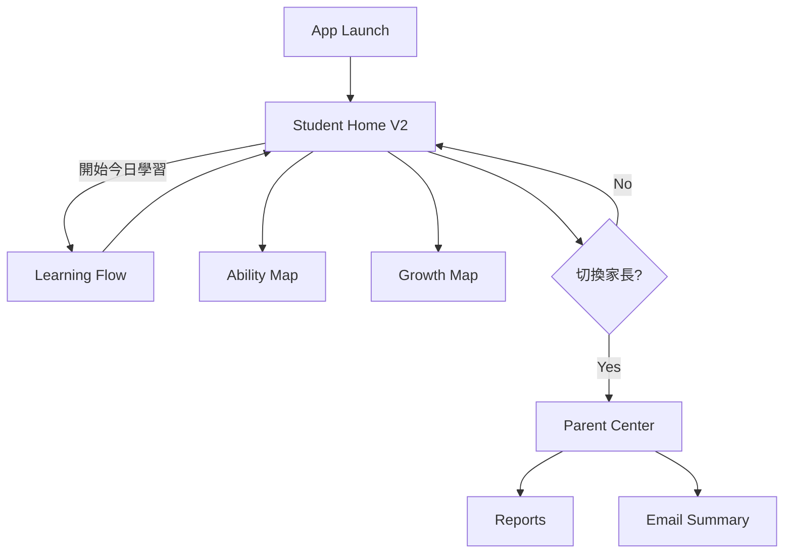

# StudySignal UI Design V1

> 第一版 UI 設計規格。所有前端畫面、元件與互動應以此文件為準，變更時請先更新本文件再改程式。

**版本：** V1  
**狀態：** Draft — 可作為開發依據，細節可持續補充  
**對象：** 產品、設計、前端

---

## 1. Design Philosophy

> 產品北極星：[`PRODUCT_PHILOSOPHY.md`](./PRODUCT_PHILOSOPHY.md)

StudySignal 是 **AI Learning Operating System for Families**。畫面讓學習變得可見，讓家長安心——不是展示 AI，也不是分析儀表板。

家長應感覺：**有一位經驗豐富的老師，安靜地看著孩子。**

| 原則 | 說明 |
|------|------|
| **Warm · Calm · Minimal · Trustworthy · Hopeful** | 溫暖、平靜、極簡、可信、充滿希望。 |
| **Reduce anxiety** | 每一個畫面都降低焦慮。禁止壓力、排名、不必要圖表。 |
| **Four parent questions** | 今天發生什麼？哪裡進步？哪裡需關注？下一步是什麼？ |
| **Signals ≠ scores** | 呈現有意義的學習訊號，而非分數堆疊。 |
| **Daily / Weekly / Monthly** | 對齊三個承諾：learned today · improving · growing。 |
| **Confidence, not AI** | 賣的是信心與理解，不是科技炫耀或代寫。 |
| **Mobile First** | 優先手機單欄；桌面為加強版。 |
| **Notebook, not dashboard** | 像 premium learning journal，而非監控中心或遊戲 UI。 |

### TODO
- [ ] 補齊「禁止樣式」清單（儀表板風、排名、焦慮圖表、過度卡片巢狀）
- [ ] 家長四問對應到各螢幕資訊架構
- [ ] 與品牌文案語氣指南對齊
---

## 2. Design Language

視覺語言定位：**Modern Minimal + Warm Learning**。

| 元素 | 規範 |
|------|------|
| 背景 | 米白色（暖中性底），避免純白刺眼與深色預設主題 |
| 主色 | 綠色 — 成長、安心、完成感 |
| AI 點綴 | 少量藍色 — 僅用於 AI／Agent 相關提示與圖示 |
| 留白 | 大留白；區塊之間呼吸感優先於資訊密度 |
| 結構 | Card-based：內容以卡片承載，一卡一事 |
| 圓角 | Rounded Corner — 友善、可親近 |
| 陰影 | Soft Shadow — 輕量層級，不用厚重多層陰影 |
| 整體 | Modern Minimal — 少邊框、少裝飾線、少徽章堆疊 |

### 氛圍參考（文字描述）

- 像安靜的書桌與溫暖的檯燈，而不是監控中心。
- 進度可見但不焦慮；AI 出現時是「引導」，不是「接管整個螢幕」。

### TODO
- [ ] 產出 Figma / 設計稿連結
- [ ] 補桌面與手機關鍵畫面 mock 清單

---

## 3. Typography

目標：清楚可讀、適合長時間學習，不追求炫耀性字體。

### 字體角色

| 角色 | 用途 | 建議方向 |
|------|------|----------|
| **Display / Title** | 頁面標題、今日目標大標 | 可稍具個性，但仍需清晰；避免過細的襯線 |
| **Body** | 說明、對話、報告內文 | 高可讀性無襯線 |
| **UI / Label** | 按鈕、Tab、表單標籤 | 與 Body 同族或近族，字重區分即可 |
| **Mono（可選）** | 極少用於技術除錯；產品 UI 預設不使用 | — |

### 字級階梯（Mobile First 建議）

| Token | 約略大小 | 用途 |
|-------|----------|------|
| `text-xs` | 12px | 輔助說明、時間戳 |
| `text-sm` | 14px | 次要內文、標籤 |
| `text-base` | 16px | 預設內文、輸入 |
| `text-lg` | 18px | 強調段落 |
| `text-xl` | 20px | 小節標題 |
| `text-2xl` | 24px | 頁面標題 |
| `text-3xl` | 30px | 儀表板主標（慎用） |

### 行高與字重

- 內文行高約 **1.5–1.65**
- 標題行高約 **1.2–1.35**
- 字重：Regular（內文）／ Medium（標籤）／ Semibold（標題、主要 CTA）

### TODO
- [ ] 選定具體字體家族與授權（Web font）
- [ ] 定義繁中／英文混排規則
- [ ] 無障礙：最小點擊區與對比度檢查

---

## 4. Color System

以 **米白底 + 綠主色 + 藍 AI 點綴** 建立語意色。以下為 V1 建議 token（實作時轉為 CSS variables）。

### 基礎色

| Token | 建議方向 | 用途 |
|-------|----------|------|
| `--color-bg` | 米白 / 暖灰白 | 頁面背景 |
| `--color-bg-elevated` | 近白卡片面 | Card、Modal 表面 |
| `--color-fg` | 深暖灰（非純黑） | 主要文字 |
| `--color-fg-muted` | 中灰 | 次要文字 |
| `--color-border` | 低對比暖灰邊 | 分隔、輸入框 |

### 品牌與語意

| Token | 色相 | 用途 |
|-------|------|------|
| `--color-primary` | 綠 | 主 CTA、進度完成、成功 |
| `--color-primary-soft` | 淺綠底 | Chip、輕量強調區 |
| `--color-ai` | 藍 | AI 氣泡邊、Agent 圖示、AI 提示 |
| `--color-ai-soft` | 淡藍底 | AI 相關背景帶 |
| `--color-warning` | 柔和琥珀 | 提醒（非錯誤） |
| `--color-danger` | 柔和紅 | 錯誤、破壞性操作 |
| `--color-success` | 與 primary 同系或更深綠 | 完成狀態 |

### 使用規則

1. **綠色**承載「學習進度／完成／行動」。
2. **藍色**僅標示「這是 AI／Agent」；不要整頁藍。
3. 背景保持米白；深色模式 **V1 不做**（TODO）。
4. 避免高飽和紫系預設主題與霓虹光暈。

### TODO
- [ ] 寫死 hex／oklch 色票表
- [ ] WCAG AA 對比驗證（文字／按鈕）
- [ ] 家長報告列印／Email 安全色

---

## 5. Spacing System

以 **4px 基準** 的間距尺度，強調大留白。

| Token | 值 | 典型用途 |
|-------|-----|----------|
| `space-1` | 4px | 圖示與文字微距 |
| `space-2` | 8px | 緊密元件內距 |
| `space-3` | 12px | 小卡片內距 |
| `space-4` | 16px | 預設內距、列表項 |
| `space-5` | 20px | 區塊內呼吸 |
| `space-6` | 24px | 卡片內距、區段間距 |
| `space-8` | 32px | 大區段分隔 |
| `space-10` | 40px | 頁面上下邊距 |
| `space-12` | 48px | 首屏主區塊留白 |

### 佈局建議

- 手機內容最大寬：全寬，左右 `space-4`–`space-6`
- 卡片間距：至少 `space-4`
- 頁面區塊之間：`space-8` 以上
- Bottom Tab 上方內容預留安全區，避免被遮擋

### TODO
- [ ] 定義 safe-area（notch / home indicator）規則
- [ ] 桌面 max-width 與雙欄斷點

---

## 6. Components

V1 元件庫範圍如下。實作時保持同一套圓角、陰影與色 token。

### 6.1 Button

| 變體 | 用途 |
|------|------|
| Primary | 主行動（開始學習、送出）— 綠底 |
| Secondary | 次要行動 — 描邊或淺底 |
| Ghost | 低干擾 — 文字／淡底 |
| AI | 與 Agent 相關的次要入口 — 少量藍 |

- 圓角：大（接近 pill 或 `rounded-xl`）
- 高度：手機主按鈕至少 ~44px 觸控區
- 禁用：降低透明度，不可只靠顏色傳達

### 6.2 Card

- 米白／近白表面 + soft shadow + 大圓角
- 一卡一主題（今日目標、能力摘要、報告條目）
- 可點卡片需有明確 hover／pressed 狀態（桌面／觸控）

### 6.3 Progress Bar

- 軌道淺灰，填充綠色
- 用於線性進度（今日完成度、任務清單）
- 可選左側／右側百分比文字（`text-sm` muted）

### 6.4 Progress Ring

- 環形進度，用於能力／單科摘要
- 完成色：綠；未完成：淺軌道
- 中央可放短數字或圖示，避免塞長文

### 6.5 AI Chat Bubble

- **AI**：淡藍／AI soft 底，左側對齊，可帶小型 AI 標記（藍）
- **學生**：淺綠或中性卡，右側對齊
- 圓角大氣泡；長文可折疊（TODO）
- 記住：聊天是 Learning Flow 的一環，不是整 app 的唯一畫面

### 6.6 Input

- 大圓角、清楚邊框、足夠內距
- 錯誤態：danger 邊框 + 輔助文字
- 支援文字與（未來）語音輸入列（見 Microphone）

### 6.7 Camera Button

- 圓形或大圓角主操作
- 圖示清楚；旁可附短標籤「拍作業」
- 狀態：idle／capturing／processing（processing 用冷靜的輕動畫）

### 6.8 Microphone Button

- 與 Camera 同級的觸控目標
- 錄音中：明確視覺（脈衝或環），但保持 Calm（避免刺眼紅閃）
- 與 Tutor 語音流程相容，但不在本文件定義音訊引擎

### 6.9 Navigation

- 頂部：簡短標題 + 可選返回
- 避免過深巢狀導覽
- 重要切換交給 Bottom Tab

### 6.10 Bottom Tab

手機主殼建議 Tab（V1）：

| Tab | 內容 |
|-----|------|
| 今天 | Student Dashboard / Today's Goals |
| 學習 | Learning Flow |
| 能力 | Ability Map |
| 成長 | Growth Map |
| 我的 | 設定／切換家長視圖入口 |

- 選中：綠色或圖示填色；未選中：muted
- 固定底部，尊重 safe-area

### 6.11 Modal

- 居中或底部 sheet（手機優先 bottom sheet）
- 半透明遮罩；內容卡 soft shadow
- 必須有明確關閉與主要行動
- 用於確認、簡短說明、家長報告預覽等

### TODO
- [ ] 各元件狀態圖（hover／focus／disabled／loading）
- [ ] 無障礙：aria、焦點環樣式
- [ ] 與現有實作元件對照表（漸進遷移）

---

## 7. Student Center

學生端是產品核心。每個畫面都應服務「今日學習」與「長期能力成長」。

### 7.1 Student Home（Dashboard V2）

**情緒順序（比資訊更重要）：**
1. 溫暖問候  
2. AI 已準備好今天  
3. 只有一個明顯下一步  
4. AI 鼓勵  
5. 做完今天就結束  

**感覺：** Apple Health / Apple Journal — 不是 Notion、不是 Trello、不是任務清單。

**視覺：**
- **唯一主卡**：「今天」— 佔頁面視覺主導
- 今日路徑以**柔和敘事**呈現（科目與時間），**不要** checklist、狀態標籤、難度徽章、打勾列
- 單一 CTA：「開始今天」
- 昨天／今日訊號／明天：頁底**小聲**文字，不用等權重卡片

**禁止：** 多個等權重卡片、任務管理感、讓學生決定「從哪開始」。

學生情緒目標：「我不用想。我只要開始。」

### 7.2 Today's Goals

**目的：** 把 Agent 規劃的「今天要完成什麼」變得可執行。

- 目標列表（卡片或 checklist）
- 每項：標題、預估時間、狀態（未開始／進行中／完成）
- 主 CTA：開始／繼續
- 完成後給溫暖回饋，不製造焦慮

### 7.3 Daily Learning Session

**目的：** StudySignal 最重要的體驗。不是通用 AI 聊天，而是老師坐在旁邊引導。

**情緒流程：**
1. Welcome back  
2. 一句話說明今日目標  
3. 一次只引導一小步  
4. 成功後鼓勵  
5. 難度自動／溫和調整  
6. 卡住時簡化，不直接給答案  
7. 短慶祝  
8. 產生今日 Learning Signals  
9. 摘要送到家長中心  

**原則：** AI 帶領；學生只專注當下這一步。平靜、鼓勵、個人化。不堆資訊、不開聊天串。

**UI：** 教師旁白（非 bubble 對話牆）+ 極淡進度 + 單一主行動。可「稍後繼續」回 Student Home。

### 7.4 Ability Map

**目的：** 呈現「我會什麼、哪裡還弱」（當下能力剖面）。

- 科目／技能維度（Ring 或簡易雷達／列表）
- 點進去看簡短說明與建議練習
- 用綠表示穩定、柔和色表示待加強（避免刺眼紅 debuff 感）

### 7.5 Growth Map

**目的：** 呈現「我變強了」（時間軸／里程碑）。

- 時間軸或週／月成長卡
- 里程碑、連勝、完成的學習旅程節點
- 與 Parent Center 報告敘事可對齊，但學生版語氣更鼓勵

### TODO
- [ ] 各畫面線框與空狀態（無目標、無資料）
- [ ] 與 Quest／成就系統的 UI 銜接點

---

## 8. Parent Center

家長端強調 **透明、安心、可掃讀**，不是再給家長一個聊天機器人。

### 8.1 Dashboard

- 本週學習概況（天數、完成目標、專注科目）
- 亮點與需關注（各 1–3 條，短句）
- 入口：詳細報告、Email 摘要設定

### 8.2 Reports

- 依週／月瀏覽
- 卡片列表 → 詳情：能力變化、完成任務、AI 建議
- 可分享／匯出（TODO）

### 8.3 Email Summary

- 設定：頻率（每週等）、收件信箱、開關
- 預覽一封摘要長什麼樣子（與產品報告語意一致）
- 清楚說明「寄什麼、不寄什麼」以建立信任

### TODO
- [ ] 家長／學生帳號切換 UX
- [ ] 隱私與資料可見範圍說明文案

---

## 9. Navigation Flow

### 9.1 高層流程

### 9.2 學生日常路徑

1. 打開 App → **Student Home** — 計畫已準備好  
2. 按 **開始今日學習** → Learning Flow  
3. 完成後回到 Student Home  
4. 一眼看到昨天／今日訊號／明天預告 — 不必自己決定下一步
5. 偶爾查看 **Ability Map**／**Growth Map** 理解成長  

### 9.3 家長路徑

1. 從「我的」或專屬入口進入 **Parent Dashboard**  
2. 查看本週摘要 → 需要時進 **Reports**  
3. 設定 **Email Summary**  

### 9.4 與現有 Talk／作業能力的關係（V1 文件層）

現有產品中的口說、拍照作業等能力，在資訊架構上應收斂為 **Learning Flow 內的任務類型**，而不是獨立成「另一個聊天 App」。UI 遷移可漸進，但導覽心智模型以此為準。

### TODO
- [ ] 補齊登入／註冊／首次 onboarding 流程圖
- [ ] 深 tie：通知點進 App 的落地頁規則

---

## 10. Future Expansion

以下項目 **刻意不在 V1 定稿**，僅預留位置：

### TODO — 體驗與視覺
- [ ] Dark mode
- [ ] 完整插畫／吉祥物系統
- [ ] 微互動與動效規範（進入、完成、AI 思考）
- [ ] 多語言 UI（介面語言 vs 學習語言分離）
- [ ] 無障礙完整稽核

### TODO — 產品模組 UI
- [ ] Achievement / Badge 展示牆
- [ ] Learning Calendar
- [ ] Knowledge Graph 視覺化
- [ ] Quest 地圖關卡 UI
- [ ] 更豐富的 AI Planner 日／週視圖

### TODO — 文件維護
- [ ] 與 `PRODUCT_ARCHITECTURE.md` 交叉連結檢查
- [ ] 設計 token 與程式 CSS variables 對照表
- [ ] 變更紀錄（Changelog）

---

*StudySignal UI Design V1 — 以學習為中心，讓 AI 安靜地幫學生把路走清楚。*
